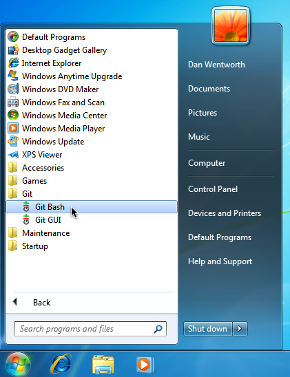

# Git Installations

To get started with Git on the command line, we need to install some system-level dependencies.

#### Installing Dependencies on OSX

To install the required dependencies on OSX, you should first open a terminal. The easiest way to do so is to hold COMMAND and press SPACE BAR, type "terminal" and hit enter.

Inside the terminal, type `git`. If Git is installed you'll get a response like this:

Otherwise, you should be prompted to install xcode. If you're not prompted, you can run `xcode-select --install` to manually install xcode, which will install git for you.

Once that finishes downloading and installing, you should see the commands displayed in the screenshot above when you run `git`.

#### Installing Dependencies on Windows

If you use Windows, the easiest way to install the required dependencies is to download and install [Git Bash](https://git-scm.com/download/win), a Unix-like terminal for Windows. After clicking the link above, click on the installer and accept all defaults.

Once that installs, you should be able to click on the Windows icon in the lower-left-hand corner of your taskbar, search for "Git Bash", and click on the Git Bash icon:

That should bring up a terminal that's fully equipped with Git.

